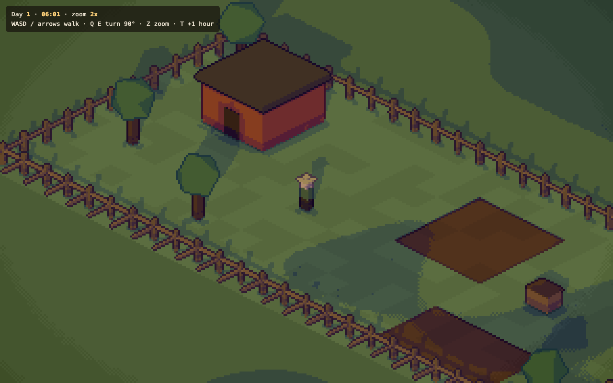

# Soil n Silo

A cozy farming and production game: one 28-day season to earn 20,000g by growing crops, raising chickens and turning both into
bread and pumpkin pie. The depth is in soil fertility, animals and processing chains rather than relationships. A 3D world drawn as
pixel art by [pixel3d-renderer](https://github.com/CelestialLemon/pixel3d-renderer), for the web.

- Design: [`docs/DESIGN.md`](docs/DESIGN.md) (the MVP design doc)
- Plan: [`docs/ROADMAP.md`](docs/ROADMAP.md), including the renderer gaps to confirm
- How the agents work here: [`AGENTS.md`](AGENTS.md) and [`docs/BOARD.md`](docs/BOARD.md)
- Models: [`docs/ASSET_BRIEF.md`](docs/ASSET_BRIEF.md)



```sh
npm install
npm run dev          # http://127.0.0.1:5190
npm test             # the game rules (src/game/), in Node
npm run typecheck
npm run build        # typecheck, then the game into dist/
```

Needs Node 22.18 or later (the tests run TypeScript directly, and installing the renderer from git builds it).

Controls for now: WASD or arrows walk (relative to the camera), Q/E turn the camera 90°, Z cycles zoom 1x/2x/3x, T skips an hour.

## Layout

```
src/
  main.ts       the game shell: loop, input, camera, and telling the renderer where everything is
  game/         game rules and state as pure TypeScript (no DOM, no renderer), unit-tested in test/
  world/        building what the renderer draws: the farm scene and the objects' geometry
test/           unit tests (Node's test runner)
docs/           design, roadmap, asset brief, the agents' board and its saved history
```

## The renderer

The game installs the renderer from a release tag: `"pixel3d-renderer": "github:CelestialLemon/pixel3d-renderer#v0.1.0"`, with
three.js 0.180 beside it. Its public API is what its `src/renderer/index.ts` exports; its README explains how a game uses it.

npm builds the renderer when it installs it from git, which needs the install script approved. The approval in `package.json`
(`allowScripts`) names the exact commit, so after changing the tag run:

```sh
npm install github:CelestialLemon/pixel3d-renderer#v0.2.0
npm install-scripts approve pixel3d-renderer
```

**Changing the renderer and the game together.** Point the game at the local checkout while you work, then go back to a tag once
the renderer change is released:

```sh
npm install ../pixel3d-renderer     # then `npm run build:lib` in the renderer after each change
```

Never commit the game pointing at a local path. Renderer bugs and missing features are issues in the renderer repo, labelled
`soil-n-silo` (see `docs/BOARD.md`, "Renderer issues").
