# Farming Game — MVP Design Doc

Oct 6, 2026 · @Ashutosh Shinde

## Overview

The MVP is one 28-day season where the player earns 20,000g by growing crops, raising chickens and processing goods. It exists to prove one thing: that farming and production chains are fun on their own, without a social layer.

The game is a cozy farming sim in the vein of Stardew Valley, with depth moved from relationships into soil, animals and processing. Visuals use a 3D scene rendered to pixel art.

**Core loop:** plant → water → harvest → feed chickens → fertilize → process goods → sell → buy upgrades → repeat with better margins.

```mermaid
flowchart LR
  Shop -- seeds, feed --> Fields
  Fields -- crops --> Bin[Shipping bin]
  Fields -- wheat --> Mill
  Fields -- scraps --> Chickens
  Shop -- feed --> Chickens
  Chickens -- eggs --> Oven
  Chickens -- manure --> Fields
  Mill -- flour --> Oven
  Fields -- pumpkin --> Oven
  Oven -- bread, pie --> Bin
  Bin -- gold --> Shop
```

*(The original doc embeds this as a 7-part diagram; this is a text version of it.)*

Manure from chickens is what restores the fields, so animals and soil quality stay tied together all season.

**In scope**

- 3 crops: wheat, tomato, pumpkin
- Soil fertility and crop quality
- 1 animal: chickens, with eggs and manure
- 2 machines: mill and oven, 3 recipes
- Shop, shipping bin, day/night clock
- 20,000g money target with bronze/silver/gold tiers

**Out of scope for the MVP**

- Energy/stamina
- Seasons and weather
- NPCs, relationships, quests
- Composter and other extra machines
- Farm expansion, multiple save slots
- Animal sickness or death

## Camera and presentation

The camera is an orthographic, isometric-style 3/4 view over the farm. The player turns it between 4 preset views 90° apart and pans it with the mouse. This keeps the diorama look while letting players see behind buildings.

| Setting | Decision | Why |
| --- | --- | --- |
| Projection | Orthographic | No perspective distortion; clean pixel output |
| Default yaw | 45° | Gives the classic iso diamond look as the home view |
| Pitch | Fixed, about 30° | Produces clean 2:1 pixel lines |
| Rotation | Snapped 90° steps (4 views) | Free orbit makes pixel art shimmer |
| Zoom | Fixed integer levels (1x, 2x, 3x) | Smooth zoom breaks pixel crispness |
| Panning | Drag with the mouse, kept over the farm; snapped to pixel-size steps | Point-and-click needs the whole farm in reach; snapping prevents shimmer |

**Readability rules**

- The tile under the pointer is always highlighted. With diamond tiles this is essential.
- Buildings and trees fade or cut away when they hide the tile under the pointer, if turning the camera turns out not to be enough.
- Soil color shows fertility (see Crops), so fields can be read without UI.

**Art note:** every model is seen from 4 sides, so it must read well all the way around. Low-poly, flat-color models are the target style.

## Player controls and interaction

The game is point-and-click (decided 2026-10-06). There is no player character in the scene: the player is the hand on the farm, pointing at one grid tile or object at a time and clicking to act. There is no energy or stamina in the MVP; time is the only daily limit.

- **No avatar and no walking.** Anything on the farm can be reached from anywhere, as long as it is on screen.
- **Camera:** drag to pan; Q/E (or on-screen buttons) turn between the 4 views; the mouse wheel steps through the zoom levels.
- **Pointing:** the tile or object under the pointer is highlighted.
- **Clicking:**
  - On a tile, click *uses* the held tool or item there (hoe, water, plant, fertilize).
  - On a thing, click *interacts* with it (machines, shop, shipping bin, trough, chickens for petting, eggs and manure for collecting).
  - A press that moves more than a few pixels is a pan, not a click.
- **Tools:** hoe, watering can, hand. Each affects one tile per click. Area tools are a post-MVP upgrade.
- **Inventory:** a hotbar plus a small backpack. Items stack.

## Time and day structure

A day lasts about 13 real minutes, from 6 AM to a 2 AM cutoff. The clock pauses whenever a menu is open.

- **Day length:** ~13 real minutes. Tune in playtests.
- **Paused in menus:** inventory, shop, and machine screens stop the clock.
- **Ending the day:** the player can end the day at any time (clicking the farmhouse or an "End day" button). At 2 AM the day ends automatically, with a penalty the next morning (exact penalty to tune).
- **Machines run on in-game hours**, so players can run several batches per day.

**Overnight, in this order:**

1. Watered crops advance one growth stage.
2. Empty tilled tiles recover fertility.
3. Fed chickens lay eggs and leave manure.
4. Shipping bin contents are sold and paid out.
5. Watered status resets on all tiles.

**Morning summary:** each day opens with a screen showing what sold, for how much, and progress toward the money target. This is a key reward moment, so it should feel good.

## Crops and soil fertility

Crops grow one stage per watered day, and every tile's fertility decides the quality of what it produces. Fertility is the system that makes this game more farming-focused than its peers.

### Crops

| Crop | Role | Grow time | Yield | Fertility drain |
| --- | --- | --- | --- | --- |
| Wheat | Fast, light, feeds the mill | 4 days | 1 per harvest | −5 |
| Tomato | Regrowing cash crop | 8 days, then every 3 days | 2 per harvest | −5 per harvest |
| Pumpkin | Slow, high value, hungry | 12 days | 1 per harvest | −15 |

**Growth rules**

- A crop advances only on days it was watered. Unwatered crops pause; they never die in the MVP.
- Each crop has 3–5 visible growth stages, built as separate low-poly meshes.
- Harvesting sometimes drops crop scraps, which can be fed to chickens.
- No seasons: every crop can be planted on any day.

### Soil fertility

- Each tile has fertility from 0 to 100. Freshly tilled ground starts at 50.
- Each harvest lowers it by the crop's drain value (table above).
- Manure used as fertilizer adds +25, capped at 100.
- A tilled tile left empty for a day recovers +5, so resting land is a real choice.
- Soil color shifts from pale to rich dark brown as fertility rises. An inspect action shows the exact number.

### Crop quality

Quality is rolled at harvest from the tile's fertility:

| Fertility | Likely result |
| --- | --- |
| Below 30 | Mostly normal |
| 30–70 | Good chance of silver |
| Above 70 | Gold becomes possible |

Exact odds are for tuning. Quality carries into processed goods (see Processing).

## Animals: chickens

Chickens are the only animal in the MVP. They turn feed and scraps into eggs for the oven and manure for the fields, tying animals into farming.

- **Housing:** one coop holding up to 6 chickens. The player starts with the coop and 2 chickens; more are bought from the shop.
- **Feeding:** a trough inside the coop, filled with bought feed or crop scraps. Each chicken eats 1 unit per day automatically.
- **Happiness (0–100):**
  - Up: fed, let outside (the player opens the coop door), petted once a day, manure collected.
  - Down: not fed.
- **Eggs:** each fed chicken lays 1 egg per day, collected by hand. Happiness sets egg quality, the same way fertility sets crop quality.
- **Manure:** each chicken leaves 1 manure per day in the coop. It is used directly on a tile as fertilizer (+25 fertility). No composter in the MVP.
- **Failure state:** an unfed chicken stops laying and loses happiness. No sickness or death.
- **Onboarding:** the starting chickens provide manure on day 1–2, so players discover fertilizer naturally.

## Processing machines and recipes

Two machines turn raw goods into higher-value products. Processing is always the better money path, just slower, and it is the game's signature system.

| Machine | Recipe | Time | Shop price |
| --- | --- | --- | --- |
| Mill | Wheat → flour | 2 in-game hours | 1,000g |
| Oven | Flour + egg → bread | 3 in-game hours | 2,500g |
| Oven | Flour + egg + pumpkin → pumpkin pie | 5 in-game hours | (same oven) |

**How machines work**

- The player loads ingredients, the machine runs on the in-game clock, and the player collects the result.
- One batch at a time per machine.
- Machines show progress visually (smoke, glow, small timer icon) so the farm can be read at a glance.
- Machines are placed on the farm like any object. The player starts with neither; buying the first is an early goal.
- All recipes are defined as data, so new recipes can be added without code changes.

**Quality through processing**

- Output quality = the average of the inputs' quality, rounded down. Gold flour + silver egg = silver bread.
- This rewards both good soil and happy chickens, and encourages matching quality.

Tomatoes have no recipe in the MVP; they are a raw cash crop.

## Economy

Wheat is quick, safe money; tomatoes pay best for low effort; pumpkins are worth the most but strip the soil. All prices are starting values to tune in playtests.

### Sell prices (normal quality)

| Item | Sell price | Input value | Notes |
| --- | --- | --- | --- |
| Wheat | 25g | 10g seed |  |
| Tomato | 20g each | 40g seed | 2 per harvest, regrows |
| Pumpkin | 250g | 80g seed |  |
| Egg | 30g | 5g feed |  |
| Flour | 40g | 25g (1 wheat) |  |
| Bread | 120g | 70g (flour + egg) |  |
| Pumpkin pie | 500g | 320g (flour + egg + pumpkin) |  |

**Quality multiplier:** silver ×1.25, gold ×1.5.

### Shop

| Item | Price |
| --- | --- |
| Wheat seed | 10g |
| Tomato seed | 40g |
| Pumpkin seed | 80g |
| Chicken feed | 5g per unit |
| Chicken | 500g |
| Mill | 1,000g |
| Oven | 2,500g |

**Selling:** items go in the shipping bin and are paid out overnight.

### Starting state

- 500g
- A coop with 2 chickens
- 15 wheat seeds
- Hoe, watering can
- A farm with about 300 tillable tiles

**Expected pacing:** mill around week 1, oven around week 2, pumpkin pie as the late-season goal.

## Win condition and progression

The goal is to earn 20,000g in total sales by the end of day 28. Total earnings count, not gold on hand, so investing in machines and chickens is never punished.

| Tier | Total earned by day 28 |
| --- | --- |
| Bronze | 10,000g |
| Silver (main goal) | 20,000g |
| Gold | 35,000g |

- **HUD tracker:** progress is always visible, e.g. "8,420 / 20,000g".
- **Target difficulty:** a skilled player should reach 20,000g around day 24–26; a new player may just miss it. Confirm with a spreadsheet sim before playtests.
- **End of day 28:** a results screen shows total earned, tier reached, best day, and items sold by type.
- **Free mode:** win or lose, the player can keep playing after day 28. This also gives longer playtest data.

## Open questions and post-MVP

### Open questions

- [ ] Exact quality odds per fertility band
- [ ] Penalty for hitting the 2 AM cutoff (start the next day late? lose a sale?)
- [ ] Without walking, what makes distance on the farm matter, if anything? (Layout may then be about readability rather than travel.)
- [ ] How often harvests drop crop scraps
- [ ] Happiness values per action, and how happiness maps to egg quality
- [ ] Does the 20,000g target hold up in a spreadsheet sim?
- [ ] Farm layout: where the coop, shipping bin and shop sit at the start
- [ ] UI and HUD layout (clock, hotbar, money tracker)

### Candidates after the MVP

- Composter machine (manure + scraps → fertilizer)
- Seasons, weather, and crop seasonality
- More animals (cows, sheep) and their product chains
- More recipes, including tomato products
- Area tools (3x3 hoe and watering can)
- Energy/stamina, if playtests show days need more structure
- Farm expansion and building upgrades
