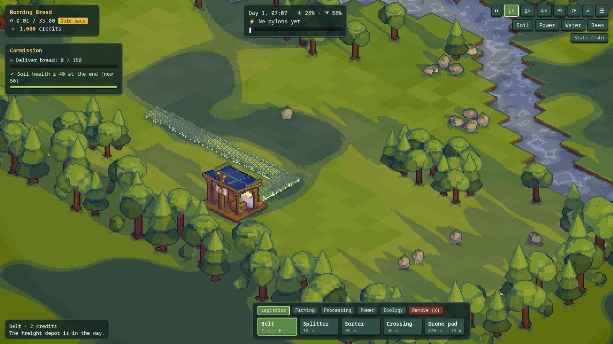
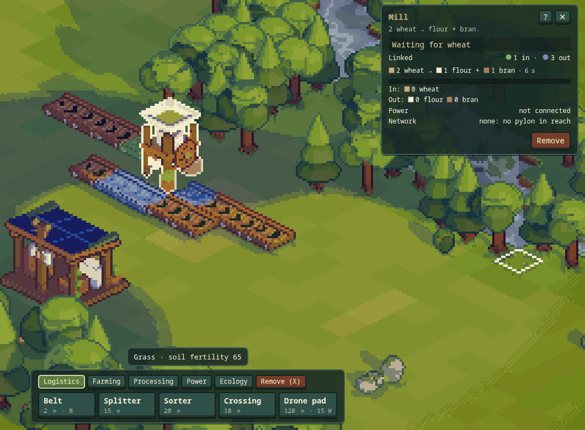
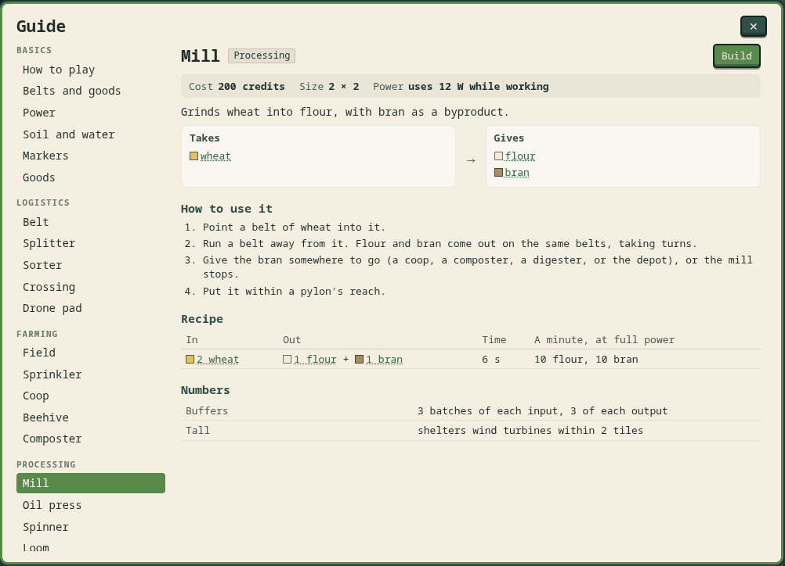
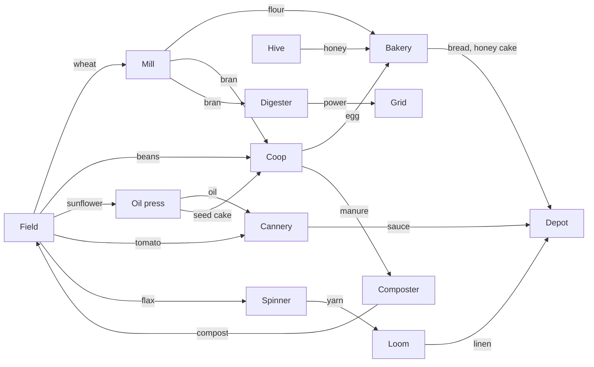
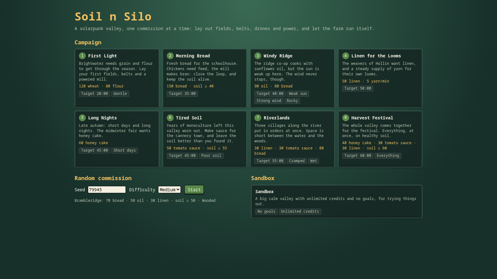

# Soil n Silo — Design (v0.1, the solarpunk pivot)

Oct 9, 2026 · @Ashutosh Shinde

## Overview

Soil n Silo is a build-only automation game in a solarpunk valley. Each level is a commission from a nearby settlement: on a
seeded map you lay out fields, belts, drones, machines and power, and the farm then runs on its own until the commission's goals
are delivered. A level takes about 30 to 60 minutes.

The game replaced a Stardew-like season (the earlier MVP, decided 2026-10-06, built by 2026-10-07) on 2026-10-09. The reason: the
only player is also the designer, so a reward loop of unlocking new crops, items and machines doesn't work: the designer already knows all of
them. An automation loop does: the fun is in building a layout, finding its bottleneck, fixing it and watching the throughput rise,
and that stays fun when every rule is known. Short, seeded levels are also quick to test, where a full season was hours.

**Core loop:** read the map (soil, water, wind, space) → lay out a chain → power it → watch it run → find the bottleneck → fix it →
deliver the commission faster.

**What makes it not Factorio:** farming. Soil is a resource that wears out and comes back, so fields need compost, resting or beans;
byproducts must go somewhere (feed, compost or the digester), so the closed loops of a real farm are the puzzle; the sun sets every
few minutes and the wind comes and goes, so power needs storage and a mix of sources.

**In v0.1**

- 18 goods, 5 crops, chickens and bees, 6 processing machines, 4 power sources and storage
- Belts, splitters, sorters, crossings and drones
- Pylon power networks, each with its own balance
- Soil fertility, sprinklers, compost and pollination
- 8 campaign commissions, random commissions from any seed, a sandbox
- A soft timer: the commission always finishes; gold, silver or bronze by how long it took

**Not in v0.1:** research or unlocks (every building is available from the start), pipes and fluids, weather events, trains,
blueprints and copy-paste, sound, multiple saves per level.

## Camera, presentation and controls

The camera stays as it was: orthographic, a 3/4 view at about 30° pitch, 4 views 90° apart (Q/E), zoom (the wheel, a trackpad pinch,
+/− or Z) and panning (drag, right-drag or the arrow keys). Zoom eases smoothly towards the pointer.

How zoom treats the pixel art is still being decided by playing. Three modes can be switched in the HUD (Zoom: Magnify, Detail,
Free), all over the same range:

- **Magnify:** the art is drawn at a fixed 16 art pixels per metre and zooming scales whole art pixels (1×1 to 6×6 on
  screen). The picture never changes, only its size; at rest the art is never resampled.
- **Detail:** art pixels stay 2×2 on screen and zooming steps through six art densities (8 to 48 per metre), so models are
  drawn with more pixels close up and fewer far out, at a few known looks. Zooming in scales the picture up and draws the
  new detail when it settles.
- **Free:** art pixels stay 2×2 on screen and the density follows the zoom continuously. Low-poly, flat-colour models drawn as pixel art by `pixel3d-renderer`. Everything is seen
from 4 sides.

It is build-only and point-and-click. There is no character and no manual farming: you place, rotate, configure and remove.

| Input | Does |
| --- | --- |
| Build bar (bottom) or hotkeys (B belt, F field, P pylon, S solar) | Pick a building to place |
| Click / drag | Place it; belts are laid along the drag (an L from where the drag started) |
| R | Rotate what you're placing (belts, splitters, sorters) |
| Click a building with nothing in hand | Select it: the inspector shows its status, buffers and settings |
| X, then click or drag | Remove (full refund) |
| Esc / right click | Drop what's in hand, close the inspector |
| Space, 1, 2, 3 | Pause, 1×, 2×, 4× speed. You can build while paused |
| Tab | Production stats |
| G | The guide: a page for every building (what it does, how to use it, what it takes and gives, its numbers), the goods, and the basics |
| V (or the buttons) | Overlays: soil fertility, power reach, sprinkler water, bee range |

**Readability rules**

- Every building shows its state on a small marker above it: working, waiting for input, output blocked, no power, low power.
- Hover any building for a one-line status ("Mill: waiting for wheat"). Hover a button in the build bar for a card about that
  building.
- Chevrons glide along every belt the way its goods go.
- Selecting (or hovering) a building tints the belts it takes goods from green and the belts that take its goods blue; the
  inspector counts them and says when a side isn't wired.
- The guide (G) has a page for every building; hovering a build button, or "?" in the inspector, leads to it.
- Soil colour shows fertility under fields. Overlays show fertility everywhere and power coverage.

## Time

The simulation runs in fixed steps of 0.1 s. A day lasts 240 s at 1× (4 minutes); a commission starts at 7 AM, and the sun shines
from 6 AM to 8 PM (scenarios change this), so night is about 40% of a day. The level timer counts simulated time, so speed controls only change
how long you wait, and pausing to plan is free.

The wind follows a smooth seeded curve between about 0.15 and 1.0 of full strength.

## The map

Each level is generated from a seed: a grid of about 48 × 40 one-metre tiles.

| Tile | Notes |
| --- | --- |
| Grass | Buildable. Has a fertility (0–100) from noise, which fields use |
| Water | A river or ponds. Not buildable. Sprinklers near water use less power |
| Rock | Not buildable. Can be cleared for 15 credits |
| Tree | Not buildable. Slows wind turbines next to it. Can be cleared for 5 credits (soil health drops a little) |

A **freight depot** (3 × 3) stands at one edge. Anything a belt or drone delivers into it counts towards the goals and pays credits.

## Goods

| Good | From | Used by | Pays |
| --- | --- | --- | --- |
| Wheat | Field | Mill | 2 |
| Beans | Field (restores soil) | Coop (feed) | 2 |
| Tomato | Field | Cannery | 3 |
| Sunflower | Field | Oil press | 3 |
| Flax | Field | Spinner | 3 |
| Egg | Coop | Bakery | 6 |
| Manure | Coop | Composter, digester | 1 |
| Honey | Beehive | Bakery | 10 |
| Flour | Mill | Bakery | 7 |
| Bran | Mill (byproduct) | Coop (feed), composter, digester | 1 |
| Oil | Oil press | Cannery | 12 |
| Seed cake | Oil press (byproduct) | Coop (feed), composter, digester | 2 |
| Compost | Composter | Fields | 4 |
| Yarn | Spinner | Loom | 10 |
| Linen | Loom | (product) | 45 |
| Bread | Bakery | (product) | 22 |
| Tomato sauce | Cannery | (product) | 40 |
| Honey cake | Bakery | (product) | 60 |

Prices and timings are starting values; they live in `src/game/data.ts`.

## Buildings

Every building is available from the start. Removing one refunds its full cost, so trying layouts is free.

### Logistics

| Building | Size | Cost | Notes |
| --- | --- | --- | --- |
| Belt | 1 × 1 | 2 | Carries goods at 1.2 tiles/s, two per tile. Takes goods from behind and both sides |
| Splitter | 1 × 1 | 15 | Takes goods from any belt leading into it and shares them between the other sides in turn, skipping full or empty exits |
| Sorter | 1 × 1 | 20 | The chosen good goes ahead; everything else goes left or right |
| Crossing | 1 × 1 | 10 | Two belts cross without mixing: goods leave on the side opposite the one they came in by |
| Drone pad | 2 × 2 | 120 | Set to send or receive. A sending pad's drone carries up to 5 goods to its linked receiving pad, 5 tiles/s, within 40 tiles. Needs 15 W while its drone flies |

Goods leave a building onto any belt next to it that doesn't point into it or lead back into it within a few tiles, taking turns between them (a belt running past a field collects its harvest). Goods enter a building from
any belt that points into it, if the building can use them and has room. Buildings never pass goods to each other directly.

### Farming

| Building | Size | Cost | Power | Notes |
| --- | --- | --- | --- | --- |
| Field | 3 × 3 | 30 | — | Grows the chosen crop on its 9 tiles. Takes compost from belts |
| Sprinkler | 1 × 1 | 25 | 3 W within 8 tiles of water, else 8 W | Waters fields whose centre is within 3 tiles |
| Coop | 3 × 3 | 150 | — | Four chickens. Every 2 feed (beans, bran or seed cake) give 2 eggs and 1 manure, 16 s |
| Beehive | 1 × 1 | 60 | — | Makes honey from flowering fields (not wheat) within 4 tiles, faster with more of them (up to 3). Pollinates fields within 4 tiles |
| Composter | 2 × 2 | 60 | — | Any 2 of manure, bran and seed cake → 1 compost, 20 s |

**Crops**

| Crop | Grows in | Yield | Soil per harvest |
| --- | --- | --- | --- |
| Wheat | 40 s | 3 | −1 |
| Beans | 50 s | 2 | +2.5 (restores) |
| Tomato | 60 s | 4 | −1.5 |
| Sunflower | 70 s | 3 | −2 |
| Flax | 55 s | 3 | −1.5 |

- Grow times are with water at fertility 60. Growth speed is ×0.4 without water, and from ×0.4 (fertility 0) to ×1.4
  (fertility 100) by the field's average fertility.
- A pollinated field (a hive within 4 tiles) yields 1 more of a flowering crop.
- A harvest waits in the field (up to 6) until a belt takes it. A full field stops growing.
- A field with compost waiting uses one whenever its average fertility is under 85: +12 on each tile.
- Ground without a field rests: it regains 0.1 fertility a second (6 a minute), up to what it started at. Moving a field
  lets worn ground recover.

### Processing (powered)

| Building | Size | Cost | Power | Recipe |
| --- | --- | --- | --- | --- |
| Mill | 2 × 2 | 200 | 12 W | 2 wheat → flour + bran, 6 s |
| Oil press | 2 × 2 | 220 | 15 W | 2 sunflower → oil + seed cake, 8 s |
| Spinner | 2 × 2 | 200 | 10 W | 2 flax → yarn, 6 s |
| Loom | 2 × 2 | 300 | 20 W | 3 yarn → linen, 10 s |
| Bakery | 2 × 2 | 350 | 25 W | flour + egg → bread, 8 s; or flour + egg + honey → honey cake, 12 s (choose) |
| Cannery | 2 × 2 | 300 | 18 W | 3 tomato + oil → tomato sauce, 10 s |

A machine holds a small buffer of each input and each output. It starts a batch when it has the inputs and room for every output.
**Byproducts are strict:** a mill whose bran has nowhere to go stops, which is the point: route it to chickens, compost or the
digester.

### Power

| Building | Size | Cost | Notes |
| --- | --- | --- | --- |
| Solar panel | 2 × 2 | 70 | 30 W at noon, following the sun; nothing at night |
| Wind turbine | 1 × 1 | 120 | 40 W at full wind; each tree or tall building within 2 tiles costs 10% (down to 40%) |
| Battery | 2 × 2 | 150 | Stores 2.4 kJ, charges and discharges at up to 40 W |
| Digester | 2 × 2 | 180 | Burns one manure, bran or seed cake every 10 s for a steady 30 W |
| Pylon | 1 × 1 | 10 | Powers buildings with any tile within 3 tiles; links to pylons within 8 tiles |

Pylons that link form a network. Each network adds up what its generators make and what its machines want; surplus charges its
batteries, a shortfall drains them, and if that isn't enough every machine on it slows to the share it gets. A building outside
every pylon's reach has no power.

### Ecology

| Building | Size | Cost | Notes |
| --- | --- | --- | --- |
| Sapling | 1 × 1 | 5 | Grows into a tree in 60 s |

**Soil health** is the average fertility of all field tiles (50 before you have a field), plus 0.25 for every tree more than
the map started with (minus for every tree fewer), at most 10 either way. Some commissions need it above a level when the rest
is delivered.

## Commissions (levels)

A commission has goals, a target time and modifiers. It ends when every goal is met.

- **Goals:** deliver *n* of a good; reach a delivery rate of a good (per minute, over the last minute); keep soil health above a
  level at the end.
- **Medals:** gold within the target time, silver within 1.5×, bronze any time after. There is no failing.
- **Modifiers:** sun strength and hours, wind strength, soil richness, how much rock, water and forest the map has, starting credits.

**Campaign** (seeds fixed, so each plays the same every time; goals, credits and target times in `src/game/scenarios.ts`):

| # | Name | Goals | Target | Modifiers |
| --- | --- | --- | --- | --- |
| 1 | First Light | 120 wheat, 80 flour | 20 min | Gentle |
| 2 | Morning Bread | 150 bread; soil health ≥ 40 | 35 min | |
| 3 | Windy Ridge | 90 oil, 80 bread | 40 min | Weak sun, strong wind, rocky |
| 4 | Linen for the Looms | 50 linen; 5 yarn/min | 50 min | |
| 5 | Long Nights | 60 honey cake | 45 min | Short days |
| 6 | Tired Soil | 50 sauce; soil health ≥ 55 | 45 min | Poor soil |
| 7 | Riverlands | 30 linen, 30 sauce, 80 bread | 55 min | Wet and cramped |
| 8 | Harvest Festival | 40 honey cake, 30 sauce, 30 linen; soil health ≥ 60 | 60 min | Everything |

The bot (`npm run sim`) clears First Light in about 14 minutes, Morning Bread in about 26 and Linen for the Looms in about 44
(one spinner; two would be faster), building instantly; a person needs a few minutes more to plan and place. The other
targets are guesses until they have bot layouts too.

**Random commission:** any seed and a difficulty (1–3) pick the modifiers and 2–4 goals.
**Sandbox:** a large calm map, unlimited credits, no goals: for trying things.

## Economy

You start with credits (1,100–1,800 by commission). Everything costs credits; every good delivered to the depot pays its price.
Early on, raw goods are the way to afford the first machines; products pay far better per field.

## Saving

The game saves the commission in progress (one at a time) in the browser every 30 s and when the page is hidden, and remembers
each commission's best medal and time.

## Open questions

- [ ] Tuning: crop times, machine times, prices and target times are first guesses. A scripted bot run per commission
  (`npm run sim`) should check that each one can be cleared and roughly in its target time.
- [ ] Do belts need curves drawn at corners, or are straight segments with gliding chevrons enough to read?
- [ ] Should drones and belts cost power? (Only drone flights do, for now.)
- [ ] Weather (rain waters fields, storms stop turbines) as a later modifier.
- [ ] Blueprints/copy-paste once layouts grow large.
